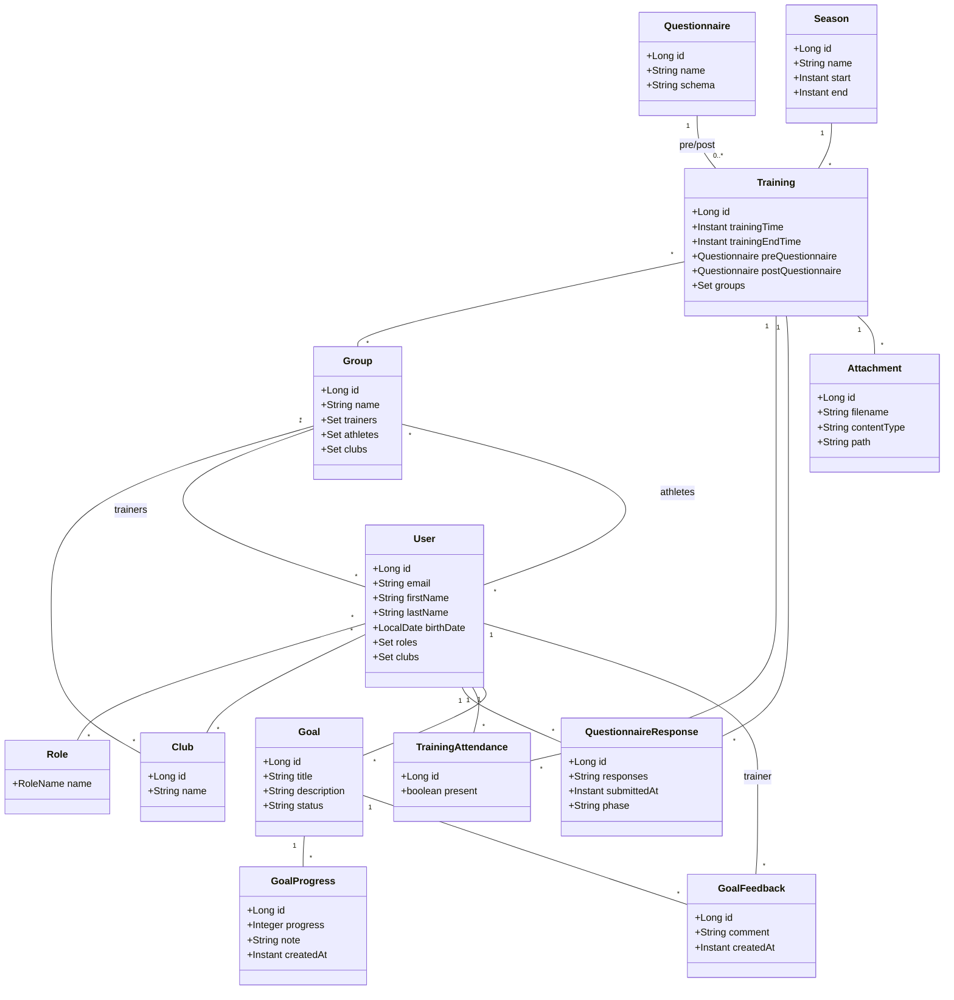
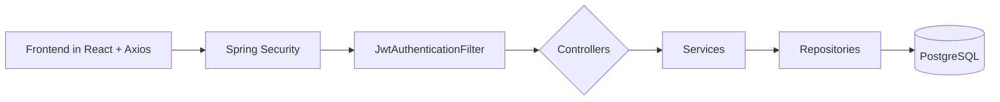

# Training Insights

Training Insights is a small full-stack application to manage club trainings, questionnaires and notifications for athletes, trainers and admins.

This repository contains two main services:

- `traininginsights-backend` — Spring Boot (Java 17) REST API
- `traininginsights-frontend` — React (Vite) single-page application

## Quick start (Docker Compose)

Build and run the app using Docker Compose (recommended for production-like local runs):

1. Build images:

```bash
docker compose build
```

2. Start containers in the background:

```bash
docker compose up -d
```

3. To view logs:

```bash
docker compose logs -f
```

4. To stop and remove containers:

```bash
docker compose down
```

Note: there are also nested `docker-compose.yml` files in both `traininginsights-backend/` and `traininginsights-frontend/` if you want to run services individually.

## Default admin credentials

On backend startup, a default superadmin account is created for initial access and demo purposes:

- Email: `superadmin@ti.local`
- Password: `superadmin`

Security note:
- Change this password immediately after first login in any non-demo environment.
- Consider disabling the auto-creation in production or rotating credentials via your secrets management.

## Build & run locally (development)

Backend (Java / Spring Boot):

- Requires JDK 17 and Maven
- From `traininginsights-backend/`:

```bash
mvn spring-boot:run
```

Frontend (React / Vite):

- Requires Node.js and npm
- From `traininginsights-frontend/`:

```bash
npm install
npm run dev
```

The frontend expects the backend at `/api` (same-origin) when served via Docker Compose or via a reverse proxy; when running frontend dev server you may need to configure a proxy (see `traininginsights-frontend/vite.config.js`).

## Tech stack

- Backend:
  - Java 17
  - Spring Boot
  - Spring Data JPA (PostgreSQL)
  - Flyway for migrations
  - JWT-based auth for API

- Frontend:
  - React with Vite
  - Material UI (MUI)
  - Axios for API calls
  - FullCalendar for calendar UI

- Dev / Ops:
  - Docker / Docker Compose
  - Nginx in front of the frontend (production image)

## Project layout

- `traininginsights-backend/`
  - `pom.xml` — Maven project
  - `Dockerfile` — backend image
  - `src/main/java/com/traininginsights/` — application code
    - `controller/`, `service/`, `repository/`, `model/`, `security/` etc.
  - `src/main/resources/application.yml` — config

- `traininginsights-frontend/`
  - `package.json`, `vite.config.js`, `Dockerfile`
  - `src/` — React app
    - `modules/` — app modules (pages, common components, api client)

## Configuration and environment

Key environment variables (can be set in Docker Compose):

- `DB_HOST`, `DB_PORT`, `DB_NAME`, `DB_USER`, `DB_PASS` — Postgres connection
- `APP_UPLOADS_DIR` — location where attachments are stored inside the container (default `uploads`)
- `TI_JWT_SECRET` — application JWT secret
- `VAPID_PUBLIC`, `VAPID_PRIVATE` — VAPID keys for Web Push notifications

### Account lifecycle (activation & password reset)

User accounts are created internally by administrators/trainers (public self‑signup is intentionally disabled to reduce abuse). New users receive an activation email containing a time‑limited token (24h). The activation flow lets the user set their initial password. Forgotten passwords use a similar tokenized reset flow (also 24h validity).

High level endpoints (paths may evolve; check OpenAPI/Swagger for latest):

- Request activation email (admin action or automatic on user creation)
- Activate account: `POST /api/auth/activate` with JSON `{ "token": "<activationToken>", "password": "<NewPassword>" }`
- Request password reset: `POST /api/auth/password-reset/request` with `{ "email": "user@example.com" }` (always returns 200 to avoid user enumeration)
- Perform password reset: `POST /api/auth/password-reset/confirm` with `{ "token": "<resetToken>", "password": "<NewPassword>" }`

Implementation notes:
- Tokens are single‑use and expire after 24 hours.
- Expired or invalid tokens return 400/404 style errors; clients should show a generic failure message.
- Activation must be completed before a user can authenticate with JWT.

### Notifications: in‑app, email (BCC) & summaries

Notifications can now be delivered via:

- In‑app only (stored notification + optional web push)
- Email only (no stored notification/push) — useful for purely informational broadcasts
- Both (persisted notification + email)

When sending to a club or group and choosing a mode that includes email, the system sends a single outbound email using BCC for all recipients (privacy + performance). If SMTP settings are configured on the target club (or any club linked to the group), the sender (if they have an email) also receives a summary email containing:

- Channel used
- Title and truncated body
- Total number of recipients
- Count of email addresses included
- Count of push deliveries attempted/succeeded
- A (possibly truncated) list of recipient email addresses

Frontend UI (Create Notification page) exposes a Channel selector with options: In‑app only, Email only, In‑app + Email.

SMTP configuration per club controls email availability; if not configured, email delivery is silently skipped and only in‑app notifications (and push) occur.

## Attachments and uploads

Attachments uploaded for trainings are stored under the configured uploads directory: `uploads/<trainingId>/filename` by default. When running in Docker make sure this path is persisted via a volume, otherwise uploaded files will be lost when containers are recreated.

## Notes for developers

- To run backend tests: `mvn test` from `traininginsights-backend/`.
- Frontend port (dev server) is configurable in `vite.config.js`.
- API base paths are under `/api/*`.

## Build and push Docker images

You can build and publish images for both services to Docker Hub.

Prerequisites:
- Docker installed and running
- A Docker Hub account and you are logged in (`docker login`)

Replace `YOUR_DOCKERHUB_USERNAME` and `TAG` (e.g., `v0.1.0` or `latest`). Run commands from the repository root unless noted.

Backend image (Spring Boot):

```bash
docker login

docker build -t YOUR_DOCKERHUB_USERNAME/traininginsights-backend:TAG traininginsights-backend

docker push YOUR_DOCKERHUB_USERNAME/traininginsights-backend:TAG
```

Frontend image (React + NGINX):

```bash
docker build -t YOUR_DOCKERHUB_USERNAME/traininginsights-frontend:TAG traininginsights-frontend

docker push YOUR_DOCKERHUB_USERNAME/traininginsights-frontend:TAG
```

Optional: multi-architecture builds (arm64 + amd64) using Buildx (useful on Apple Silicon):

Backend:

```bash
docker buildx build --platform linux/amd64,linux/arm64 \
  -t YOUR_DOCKERHUB_USERNAME/traininginsights-backend:TAG \
  traininginsights-backend --push
```

Frontend:

```bash
docker buildx build --platform linux/amd64,linux/arm64 \
  -t YOUR_DOCKERHUB_USERNAME/traininginsights-frontend:TAG \
  traininginsights-frontend --push
```

Compose-based alternative: declare image tags in `docker-compose.yml` and use Compose to build/push.

1) Add under each service:

```yaml
services:
  backend:
    image: YOUR_DOCKERHUB_USERNAME/traininginsights-backend:TAG
    build:
      context: ./traininginsights-backend
      dockerfile: Dockerfile
  frontend:
    image: YOUR_DOCKERHUB_USERNAME/traininginsights-frontend:TAG
    build:
      context: ./traininginsights-frontend
```

2) Build and push:

```bash
docker login
docker compose build
docker compose push
```

Run the pushed images directly (example):

```bash
# Backend
docker run -p 8080:8080 --name ti-backend \
  -e DB_HOST=db.host \
  -e DB_PORT=5432 \
  -e DB_NAME=traininginsights \
  -e DB_USER=postgres \
  -e DB_PASS=postgres \
  -e TI_JWT_SECRET="super-long-secret" \
  -e SPRING_PROFILES_ACTIVE=docker \
  YOUR_DOCKERHUB_USERNAME/traininginsights-backend:TAG

# Frontend
docker run -p 3000:80 --name ti-frontend \
  -e VITE_API_BASE=/api \
  YOUR_DOCKERHUB_USERNAME/traininginsights-frontend:TAG
```

Notes:
- Configure `VAPID_PUBLIC`/`VAPID_PRIVATE` if you enable push notifications.
- Persist uploads by mounting a volume for the backend `APP_UPLOADS_DIR` (default `uploads`).

## Backup and restore (superadmin)

The app provides data-only JSON backups as well as full backups that include attachment files. These actions require the `ROLE_SUPERADMIN` role.

## Metrics dashboard

Superadmins and admins land on a role‑aware metrics dashboard that summarizes key operational statistics:

- Total clubs (global or limited to the admin's clubs / selected club)
- Total users and inactive (non‑activated) users
- Emails sent (counts individual recipients, including BCC recipients)
- Password resets performed
- Biggest club (by distinct users) — superadmin only (global scope)
- Users per club table (sorted descending by user count)

Endpoint:
`GET /api/metrics/dashboard?clubId=<optional>`

Authorization:
- `ROLE_SUPERADMIN` — global metrics (ignores `clubId`)
- `ROLE_ADMIN` — metrics restricted to the admin's clubs; optional `clubId` narrows scope.

Response shape (example):
```json
{
  "totalClubs": 3,
  "totalUsers": 128,
  "inactiveUsers": 5,
  "totalEmailsSent": 420,
  "totalPasswordResets": 12,
  "biggestClub": { "id": 7, "name": "Brussels Endurance", "userCount": 56 },
  "usersPerClub": [
    { "id": 7, "name": "Brussels Endurance", "userCount": 56 },
    { "id": 3, "name": "Gent Track", "userCount": 44 },
    { "id": 9, "name": "Leuven Juniors", "userCount": 28 }
  ]
}
```

Front end component: `src/modules/dashboards/MetricsDashboard.jsx`.

Admin club preference persistence: the last selected club filter is stored in `localStorage` under `ti_metrics_club`.

## Date & time formatting (Belgian standard)

All displayed dates are normalized to Belgian style `dd/MM/yyyy` and 24‑hour time. Utility helpers live in `traininginsights-frontend/src/modules/common/dateUtils.js` (formatters `formatIsoDate` and `formatIsoDateTime`). Custom picker components are provided in `BelgianPickers.jsx` and used across forms (users, goals, trainings, questionnaires).

## Theme (Light / Dark / System)

The frontend supports a tri-mode theme selector (System, Light, Dark). The current mode is stored in `localStorage` under `ti_theme_mode` and defaults to `system`, following the OS/browser `prefers-color-scheme` setting. A listener updates automatically if the OS preference changes while in system mode.

Access: click the avatar in the top right and use the "Theme:" menu item to cycle modes.

Implementation:
`ThemeContext.jsx` provides `ThemeModeProvider` which wraps the app in a dynamic MUI theme. State keys:
- `mode`: `system | light | dark`
- `resolvedMode`: actual applied palette mode when `mode=system`.


### Export (download)

- UI (recommended): Dashboard → Backup
  - Download data only (JSON): exports database content as `ti-backup.json`.
  - Download full backup (ZIP): exports `ti-backup.zip` with:
    - `data.json` – full database export
    - `attachments.json` – attachment metadata (id, trainingId, filename, contentType, relativePath)
    - `uploads/` – all referenced attachment files

- API (optional)
  - Data only:
    - GET `/api/admin/backup/export` → application/json
  - Full backup:
    - GET `/api/admin/backup/export-zip` → application/zip

### Restore (upload)

- UI (recommended): Dashboard → Backup → Upload backup to import (JSON or ZIP)
  - JSON file imports database content only.
  - ZIP file restores both database content and attachment files to the configured `app.uploadsDir`.

- API (optional)
  - Data only import: POST `/api/admin/backup/import` with `multipart/form-data` (field `file` = JSON)
  - Full import: POST `/api/admin/backup/import-zip` with `multipart/form-data` (field `file` = ZIP)

### Disaster recovery checklist

1) Ensure persistent volumes are in place
   - Database: your Postgres volume (data directory)
   - Uploads: backend `app.uploadsDir` (default `uploads`) mounted as a volume

2) Start database and backend with correct env
   - `TI_JWT_SECRET` set (same secret or a compatible one)
   - `SPRING_PROFILES_ACTIVE=docker` if using the Docker profile
   - `APP_UPLOADS_DIR` pointing to the mounted volume path

3) Log in as superadmin
   - Default credentials: `superadmin@ti.local` / `superadmin` (rotate in production)

4) Restore latest `ti-backup.zip`
   - Dashboard → Backup → Upload backup → select ZIP
   - Wait for completion; results summary is shown

5) Validate
   - Trainings present; attachments visible and downloadable
   - Optional: Inspect `uploads/` volume contains files

### Notes and limits

- Import strategy is idempotent-ish: entities are inserted or updated by id when possible.
- Attachment files are restored only under `app.uploadsDir` and paths are validated (no writes outside base directory).
- Large backups: if you see payload size errors, increase multipart limits, e.g. in Spring config:
  - `spring.servlet.multipart.max-file-size=512MB`
  - `spring.servlet.multipart.max-request-size=512MB`
- Automating backups: schedule the ZIP export and store off-site. Example (Docker host cron):

```bash
# Pseudo-example; ensure proper auth headers are used
curl -H "Authorization: Bearer <SUPERADMIN_TOKEN>" \
  -o /backups/ti-$(date +%F).zip \
  http://backend:8080/api/admin/backup/export-zip
```

## Architecture and object model

The app is a classic React SPA + Spring Boot API with JWT auth. Below are concise schematics showing the domain objects and how requests flow through the system.

### Domain model (ERD-style)



Legend

| Label / Notation | Meaning |
|---|---|
| pre/post | A Training can reference a Questionnaire as its preQuestionnaire or postQuestionnaire |
| trainers | Users assigned as trainers of a Group |
| athletes | Users who are athletes in a Group |
| trainer | The User who authored a GoalFeedback (must have trainer role) |
| 1, * , 0..* | Multiplicity (one, many, zero-or-many) |

Notes
- Groups can have multiple trainers and belong to multiple clubs. Athletes are members of groups.
- A training targets one or more groups; roster is the union of those groups’ athletes. Presence is tracked per (training, user) in TrainingAttendance.
- Pre/post questionnaires are optional; responses are JSON documents keyed by field name (numeric fields power analytics).
- Seasons group trainings over time; goals are scoped to users (with optional progress notion in the UI).

### Request flow and security



Key rules
- JWT roles: ROLE_ATHLETE, ROLE_TRAINER, ROLE_ADMIN, ROLE_SUPERADMIN.
- Trainers only see trainings of groups they train; athletes see their group’s trainings; admins/superadmins see all.
- Analytics scoping: when a trainer omits `groupId`, results are limited to the groups they train. When `groupId` is specified, the trainer must be assigned to that group.
- Group management: admins of a group’s clubs or trainers already assigned to the group can edit trainers on the Groups page.

### How core features work together

- Create/edit training
  - Trainer/admin creates a training and selects target groups.
  - Roster derives from the union of selected groups’ athletes.
  - Optional pre/post questionnaires are attached.

- Attendance (roster toggles)
  - UI lists eligible athletes; toggles write `TrainingAttendance` records.
  - Presence analytics compute rate = present / eligible for the selected dimension and period.

- Questionnaire analytics
  - Responses store numeric fields in `QuestionnaireResponse.responses` (JSON).
  - Aggregations run in-memory or via optimized JSON SQL, grouped by athlete/group/club/age and day/week/month/training.

- Notifications
  - Admins/trainers compose notifications to selected groups/clubs; the backend fan-outs to users and optionally Web Push (if VAPID configured).

Frontend navigation (selected)
- Admins: Clubs, Admins, Trainers, Athletes, Club Members, Push Config, SMTP, Seasons, Notifications, Create Notification, Groups.
- Trainers: Groups, Athletes, Trainings, Questionnaires, Goals, Analytics, Notifications, Create Notification.
